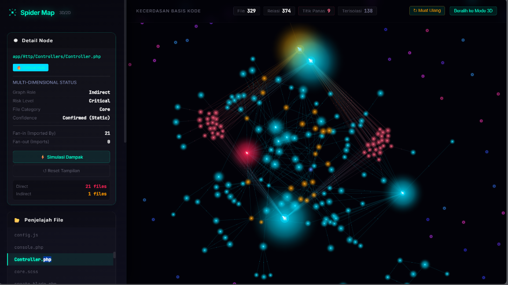
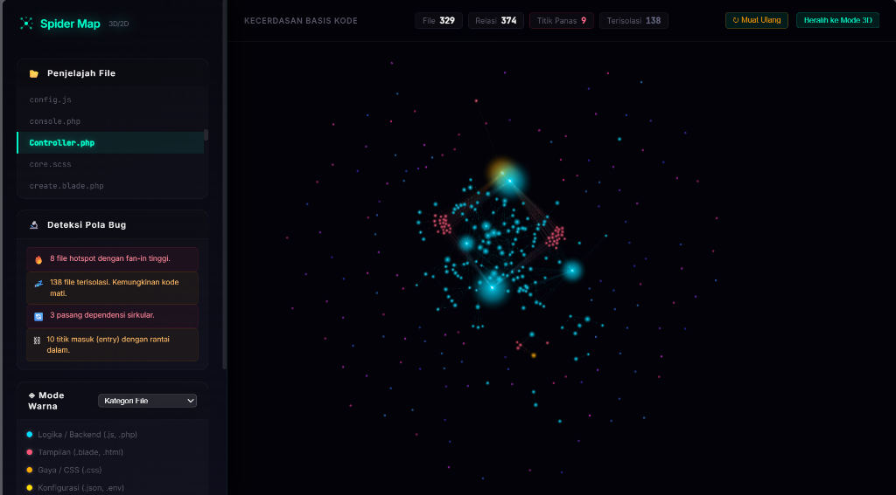
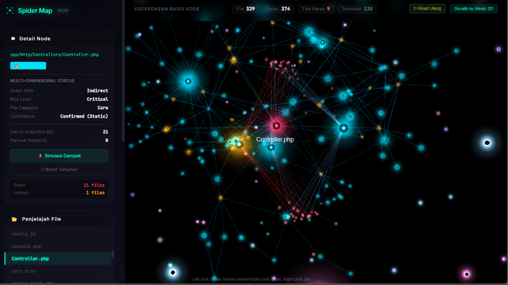
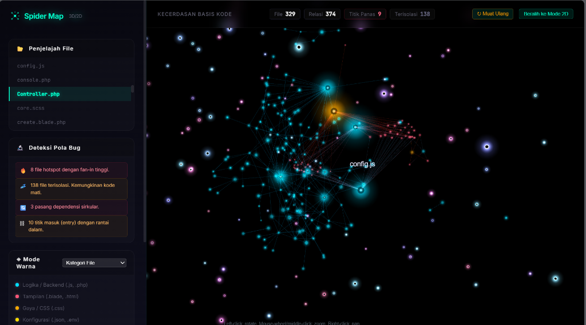

# 🕷️ Spider Map 3D - Peta Codebase Universal

> **Model Context Protocol (MCP) Server** yang membantu AI memahami struktur dan dependensi codebase Anda dalam berbagai bahasa pemrograman.

[](https://github.com/rofid-c/codebase-analyzer-mcp)
[](https://modelcontextprotocol.io/)
[](https://www.typescriptlang.org/)
[](./LICENSE)

---

### 🤔 Apa itu Spider Map / Codebase Analyzer?
**Spider Map** adalah sistem yang bertindak sebagai **"Ingatan Jangka Panjang" (Codebase Memory)** untuk AI Assistant (seperti Claude, Cursor, dll). 

Bayangkan Anda memiliki proyek dengan ribuan file. Ketika Anda menyuruh AI mengubah satu fungsi, AI sering kali merusak bagian lain karena ia tidak tahu file apa saja yang saling terhubung. **Spider Map menyelesaikan masalah ini** dengan cara:
1. 🕸️ **Memetakan seluruh file** dan mendeteksi dependensi (siapa *import* siapa) secara otomatis.
2. 🔮 **Mensimulasikan Dampak (Blast Radius)**: Memberitahu AI file mana saja yang akan ikut *error* jika sebuah file diubah.
3. 🗺️ **Visualisasi 3D**: Menampilkan seluruh struktur kode Anda dalam bentuk grafik WebGL 3D yang interaktif, sehingga manusia dan AI bisa sama-sama melihat "peta" proyek.

<div align="center">
  
  <br/><br/>
  <table>
    <tr>
      <td></td>
      <td></td>
    </tr>
    <tr>
      <td colspan="2"></td>
    </tr>
  </table>
</div>

---

## 📖 Daftar Isi

- [✨ Fitur Utama](#-fitur-utama)
- [🚀 Quick Start](#-quick-start)
- [📂 Struktur Project](#-struktur-project)
- [🌍 Dukungan Multi-Bahasa](#-dukungan-multi-bahasa)
- [🤖 MCP Tools](#-mcp-tools)
- [⚡ Auto-Indexing](#-auto-indexing)
- [🎨 Visualisasi 3D](#-visualisasi-3d)
- [🧮 Algoritma & Optimasi](#-algoritma--optimasi)
- [📊 Performa](#-performa)
- [🔧 Konfigurasi](#-konfigurasi)
- [🐛 Troubleshooting](#-troubleshooting)
- [⚠️ Known Limitations](#️-known-limitations)
- [📚 Dokumentasi Lengkap](#-dokumentasi-lengkap)

---

## ✨ Fitur Utama

### 🌐 **Multi-Language Support** (15+ Bahasa)
Mendukung JavaScript/TypeScript, Python, PHP, Dart, Go, Rust, Java, Kotlin, C/C++, C#, Ruby, Swift, CSS, HTML, dan lainnya dengan deteksi dependency otomatis.

### 🎯 **Dependency Tracking** 
Otomatis mendeteksi imports, requires, dan dependencies lintas file dengan parser khusus untuk setiap bahasa.

### 💥 **Impact Analysis** (Blast Radius)
Simulasi dampak perubahan file - lihat file mana saja yang akan terpengaruh secara langsung dan tidak langsung.

### 🔥 **Hotspot Detection**
Identifikasi file critical yang banyak digunakan (fan-in tinggi) - file yang berisiko tinggi jika diubah.

### 📊 **Risk Assessment**
Kategorisasi file berdasarkan tingkat risiko: Critical, Moderate, Low, dan Leaf (aman).

### 🎨 **Visualisasi 3D Interaktif**
Eksplorasi codebase dalam bentuk WebGL graph 3D yang cantik dengan efek neon dan gelembung bercahaya.

### ⚡ **Auto-Indexing Hybrid**
File watcher dengan debounce 2-3 detik - deteksi perubahan real-time dan update index otomatis.

### 🗜️ **Token Optimization**
Kompresi output hingga 80-96% menggunakan symbol tables dan binary-like format untuk menghemat biaya AI.

### 🕰️ **4D Temporal Analysis**
Analisis evolusi codebase dari waktu ke waktu dengan prediksi hotspot dan pattern detection.

### 🤖 **AI-Optimized Output**
Format output khusus yang dioptimalkan untuk AI assistants dengan berbagai response modes.

### 🛡️ **Anti AI-Looping & Token Saver**
Dilengkapi mekanisme pelindung otomatis (explicit `[TRUNCATED]` warning, sinyal sinkronisasi *indexing*, serta pemotongan pintar berdasarkan *risk level*) agar agen AI tidak kehabisan kuota token dan tidak terperangkap *looping* saat menganalisis codebase masif.

---

## 🚀 Quick Start

### **Prasyarat**

Sebelum instalasi, pastikan Anda sudah install:
- **Node.js** v18 atau lebih baru ([Download](https://nodejs.org))
- **npm** atau **yarn** (biasanya sudah include dengan Node.js)
- **Git** ([Download](https://git-scm.com))

### **Instalasi**

#### **Metode 1: Clone dari GitHub (Recommended)**

```bash
# 1. Clone repository
git clone https://github.com/rofid-c/codebase-analyzer-mcp.git
cd codebase-analyzer-mcp

# 2. Install dependencies
npm install

# 3. Build project (compile TypeScript)
npm run build

# 4. Verify installation
npm run crawl -- --help
```

#### **Metode 2: Download ZIP**

```bash
# 1. Download ZIP dari GitHub
# https://github.com/rofid-c/codebase-analyzer-mcp/archive/refs/heads/main.zip

# 2. Extract ZIP file
# 3. Open terminal di folder extract

# 4. Install dependencies
npm install

# 5. Build project
npm run build
```

#### **Metode 3: NPM Global Install** (Coming Soon)

```bash
# Install globally (akan tersedia di npm registry)
npm install -g spider-map-mcp

# Gunakan langsung
spider-map crawl --path /path/to/project
```

### **Verifikasi Instalasi**

```bash
# Cek apakah build berhasil
ls dist/

# Harus ada folder:
# - dist/mcp/server.js
# - dist/core/*.js
# - dist/index.js

# Test crawl (output ringkas)
npm run crawl

# Test crawl dengan log detail
npm run crawl -- --verbose

# Output yang diharapkan (tanpa verbose):
# ✅ Spider Map generated successfully!
# ────────────────────────────────────────
#    ⏱️ Time:         0.07s
#    📄 Files:        35
#    🔗 Links:        32
#    ⚡ Entry Points: 7
#    🔥 Hotspots:     1
#    💤 Orphans:      16
#    🚨 Critical:     0
```

### **Setup untuk AI Assistant**

Setelah instalasi, setup MCP server:

```bash
# Auto setup (detect & configure AI assistant otomatis)
npm run setup

# Output:
# 🕷️ Spider Map MCP - Auto Setup 🕷️
# Mendeteksi Claude Desktop...
# ✅ Berhasil ditambahkan ke Claude Desktop
# 🎉 Setup Selesai! Restart aplikasi AI Assistant Anda.
```

**Lokasi config yang ditambahkan:**
- **Windows**: `%APPDATA%\Claude\claude_desktop_config.json`
- **Mac**: `~/Library/Application Support/Claude/claude_desktop_config.json`
- **Linux**: `~/.config/Claude/claude_desktop_config.json`

**Restart AI assistant** (Claude Desktop, Cursor, dll) dan tools Spider Map sudah siap!

### **Penggunaan Dasar**

#### 1️⃣ **Command Line (Manual Crawl)**

```bash
# Scan direktori saat ini (output ringkas)
npm run crawl

# Scan direktori dengan log proses detail (verbose)
npm run crawl -- --verbose

# Scan project tertentu
npm run crawl -- --path "C:\path\to\your\project"

# Auto-indexing mode (file watcher + 2 detik debounce)
npm run crawl -- --watch

# Watch project tertentu dengan log detail
npm run crawl -- --path "/path/to/project" --watch --verbose
```

#### 2️⃣ **Integration dengan AI (MCP Server)**

**Auto Setup (Recommended):**
```bash
npm run setup
```
Script akan otomatis mendeteksi dan konfigurasi AI assistant Anda (Claude Desktop, Cursor, Antigravity IDE, dll).

**Manual Setup:**
Edit file konfigurasi MCP Anda (`claude_desktop_config.json` atau `mcp_config.json`):

```json
{
  "mcpServers": {
    "spider-map": {
      "command": "node",
      "args": ["/path/to/codebase-analyzer-mcp/dist/mcp/server.js"]
    }
  }
}
```

Restart AI assistant Anda, dan tools Spider Map sudah siap digunakan!

#### 3️⃣ **Web UI (Visualisasi 3D)**

```bash
# Development mode
npm run dev

# Build & preview
npm run build
npm run preview
```

Buka browser di `http://localhost:5173` untuk melihat visualisasi 3D interaktif.

---

## 📂 Struktur Project

```
spider-map-mcp/
├── src/
│   ├── core/                    # Core functionality
│   │   ├── crawler.ts           # File system crawler
│   │   ├── parser.ts            # Multi-language parser
│   │   ├── graph.ts             # Graph builder & impact simulator
│   │   ├── cache.ts             # Caching system
│   │   ├── compressor.ts        # Token compression
│   │   ├── metrics.ts           # Code metrics & change detection
│   │   ├── temporal.ts          # 4D temporal analysis
│   │   ├── temporal-advanced.ts # Advanced temporal queries
│   │   ├── auto-indexer.ts      # Auto-indexing system
│   │   └── types.ts             # TypeScript types
│   ├── mcp/
│   │   └── server.ts            # MCP server implementation
│   ├── ui/
│   │   ├── index.html           # Web UI entry
│   │   ├── main.ts              # 3D visualization logic
│   │   └── style.css            # UI styling
│   └── index.ts                 # CLI entry point
├── scripts/
│   └── setup.js                 # Auto MCP setup
├── public/                      # Static assets
├── .spidermap/                  # Cache directory
│   └── graph.json               # Cached graph data
├── spider-map.config.ts         # Configuration presets
└── README.md                    # This file
```

---

## 🌍 Dukungan Multi-Bahasa

Spider Map mendukung **15+ bahasa pemrograman** dengan parser khusus:

| Bahasa | Status | Import Detection | Framework Support |
|--------|--------|------------------|-------------------|
| **JavaScript/TypeScript** | ✅ Full | ESM, CommonJS, Dynamic | React, Vue, Node.js, Next.js |
| **Python** | ✅ Full | Absolute, Relative | Django, Flask, FastAPI |
| **PHP** | ✅ Full | Use, Include, Require | Laravel, Symfony, WordPress |
| **Dart** | ✅ Full | Package, Relative | Flutter |
| **Go** | ✅ Full | Package imports | Standard, Gin, Echo |
| **Rust** | ✅ Full | Use, Mod | Cargo, Tokio, Actix |
| **Java/Kotlin** | ✅ Full | Package imports | Spring Boot, Android |
| **C/C++** | ✅ Full | Include | Standard, Qt |
| **CSS/SCSS** | ✅ Full | Import, URL | All preprocessors |
| **HTML/Vue** | ✅ Full | Assets | Vue, Svelte |
| **C#** | 🔄 Partial | Coming soon | .NET, Unity |
| **Ruby** | 🔄 Partial | Coming soon | Rails |
| **Swift** | 🔄 Partial | Coming soon | iOS, SwiftUI |
| **SQL** | ✅ Basic | Schema detection | All databases |
| **Config Files** | ✅ Full | JSON, YAML, TOML | All formats |

### **Kategori File Otomatis**

Setiap file dikategorikan otomatis:

- 🔵 **Core**: Backend/logic code (`.js`, `.py`, `.php`, `.go`, `.rs`, `.java`)
- 🟢 **View**: Frontend templates (`.blade.php`, `.vue`, `.html`, `.jsx`, `.tsx`)
- 🟡 **Style**: Styling files (`.css`, `.scss`, `.sass`, `.less`)
- 🟠 **Config**: Configuration (`.json`, `.yml`, `.toml`, `package.json`)
- 🟣 **Test**: Test files (`*.test.js`, `*.spec.ts`, `*_test.dart`)
- 🔴 **Database**: Database files (`.sql`, `.prisma`, migrations)
- ⚪ **Doc**: Documentation (`.md`, `.rst`, `.txt`)
- ⚫ **Utility**: Helper files (`.h`, `.hpp`, utilities)
- 🎨 **Asset**: Static assets (images, fonts, media)

---

## 🤖 MCP Tools

Spider Map menyediakan **11 tools** untuk AI:

### 1. **`configure_auto_indexing`** 🔧
Aktifkan auto-indexing dengan file watcher dan debounce.

```json
{
  "tool": "configure_auto_indexing",
  "arguments": {
    "projectRoot": "/path/to/project",
    "debounceMs": 3000,
    "enableFileWatcher": true,
    "enablePeriodicSync": false
  }
}
```

### 2. **`get_project_map`** 📊
Generate atau load dependency graph dengan berbagai mode response.

```json
{
  "tool": "get_project_map",
  "arguments": {
    "projectRoot": "/path/to/project",
    "responseMode": "compressed"  // full, summary, compressed, critical-only
  }
}
```

**Response Modes:**
- `full`: Full JSON (~12,500 tokens†)
- `compressed`: Binary-like format (~2,500 tokens†, 80% savings)
- `summary`: Stats only (~500 tokens†, 96% savings)
- `critical-only`: Hotspots + critical files (~1,500 tokens†, 90% savings)

> †Estimasi token menggunakan rumus `chars ÷ 4`. Jumlah token sesungguhnya
> dapat bervariasi tergantung tokenizer model AI yang digunakan.

### 3. **`get_file_info`** 📄
Dapatkan info detail tentang file tertentu (98% token reduction).

```json
{
  "tool": "get_file_info",
  "arguments": {
    "projectRoot": "/path/to/project",
    "filePath": "src/models/User.ts"
  }
}
```

**Returns:**
- File properties (role, risk, category)
- Import list
- Imported-by list  
- Impact radius (direct + indirect)

### 4. **`simulate_impact`** 💥
Simulasi blast radius jika mengubah file tertentu.

```json
{
  "tool": "simulate_impact",
  "arguments": {
    "projectRoot": "/path/to/project",
    "targetFile": "src/models/User.ts"
  }
}
```

**Returns:**
```json
{
  "changedFile": "src/models/User.ts",
  "directlyAffected": ["src/controllers/UserController.ts", "src/services/AuthService.ts"],
  "indirectlyAffected": ["src/routes/api.ts", "src/index.ts"],
  "totalAffectedCount": 4
}
```

### 5. **`search_files`** 🔍
Cari files berdasarkan criteria (risk, role, category, dll).

```json
{
  "tool": "search_files",
  "arguments": {
    "projectRoot": "/path/to/project",
    "filters": {
      "riskLevel": "critical",
      "minImportedByCount": 10,
      "fileCategory": "core"
    }
  }
}
```

### 6. **`get_code_metrics`** 📈
Dapatkan code metrics: complexity, LOC, test coverage, dll.

```json
{
  "tool": "get_code_metrics",
  "arguments": {
    "projectRoot": "/path/to/project",
    "filePath": "src/models/User.ts"
  }
}
```

### 7. **`detect_changes`** 🔄
Deteksi file mana yang berubah sejak crawl terakhir.

```json
{
  "tool": "detect_changes",
  "arguments": {
    "projectRoot": "/path/to/project",
    "forceRefresh": false
  }
}
```

### 8. **`get_time_analysis`** 🕰️
4D temporal analysis: track evolution codebase dari waktu ke waktu.

```json
{
  "tool": "get_time_analysis",
  "arguments": {
    "projectRoot": "/path/to/project",
    "timeRange": { "days": 30 },
    "includePositioning": true
  }
}
```

### 9. **`predict_hotspots`** 🔮
Prediksi file yang akan menjadi problematik berdasarkan trend.

```json
{
  "tool": "predict_hotspots",
  "arguments": {
    "projectRoot": "/path/to/project",
    "daysAhead": 30,
    "riskThreshold": 50
  }
}
```

### 10. **`query_temporal`** 📊
Advanced temporal queries: trend, volatility, velocity, patterns.

```json
{
  "tool": "query_temporal",
  "arguments": {
    "projectRoot": "/path/to/project",
    "queryType": "trend",
    "trendType": "increasing",
    "minConfidence": 70
  }
}
```

### 11. **`analyze_evolution`** 🧬
Comprehensive evolution analytics dengan recommendations.

```json
{
  "tool": "analyze_evolution",
  "arguments": {
    "projectRoot": "/path/to/project",
    "periodDays": 90,
    "includePatterns": true
  }
}
```

---

## ⚡ Auto-Indexing

Spider Map mendukung **auto-indexing hybrid** dengan file watcher dan debounce:

### **Cara Kerja:**

```
File change detected
         ↓
    [0ms] Queued for update
         ↓
    [1s] More changes... [Reset timer]
         ↓
    [2s] More changes... [Reset timer]
         ↓
    [3s] No more changes
         ↓
    [3000ms] Debounce triggered → Batch reindex
         ↓
    Cache updated ✅
```

### **Mode Konfigurasi:**

#### **1. Development Mode** (Default)
- ✅ Real-time file watcher
- ✅ 3-second debounce
- ✅ Incremental updates only
- ✅ Low latency (~500ms detection)

```bash
npm run crawl -- --watch
```

#### **2. Production Mode**
- ✅ Periodic sync every 5-10 minutes
- ✅ No real-time watcher (lower resource)
- ✅ Full reindex periodically
- ✅ Best for stability

```typescript
import { initializeAutoIndexer } from './dist/core/auto-indexer.js';

await initializeAutoIndexer({
  projectRoot: '/path/to/project',
  debounceMs: 5000,
  enableFileWatcher: false,
  enablePeriodicSync: true,
  periodicSyncMs: 10 * 60 * 1000  // 10 minutes
});
```

#### **3. Lightweight Mode**
- ✅ Real-time watcher
- ✅ No periodic sync
- ✅ 5-second debounce
- ✅ Minimal overhead

---

## 🕰️ 4D Temporal Analysis

Spider Map memiliki fitur **4D Analysis** yang revolusioner - analisis codebase tidak hanya dalam 3 dimensi ruang (X, Y, Z) tetapi juga dimensi **Waktu (T)**!

### **Konsep 4D: Ruang + Waktu**

```
Dimensi 1: X-axis (Horizontal positioning)
Dimensi 2: Y-axis (Vertical positioning)  
Dimensi 3: Z-axis (Depth/layer positioning)
Dimensi 4: T-axis (Time evolution) ⭐ UNIQUE!
```

### **Apa Yang Dilacak:**

#### **📈 Evolution Metrics**
Setiap file ditrack evolusinya dari waktu ke waktu:
- **Complexity Growth**: Apakah file semakin kompleks?
- **Dependency Changes**: Berapa banyak import/export yang berubah?
- **Risk Level Evolution**: File safe menjadi risky atau sebaliknya?
- **Hotspot Emergence**: File biasa menjadi hotspot

#### **🔮 Predictive Analytics**
Menggunakan **heuristic scoring** berdasarkan tren historis:
- **Future Hotspots**: File mana yang akan bermasalah 30 hari ke depan (berdasarkan weighted formula)
- **Technical Debt Prediction**: File yang perlu refactoring urgent
- **Stability Score**: Seberapa stabil file dari perubahan
- **Change Velocity**: Frekuensi perubahan file

#### **📊 Pattern Detection**
Deteksi pola temporal otomatis:
- **Cyclic Patterns**: File yang diubah secara periodik
- **Burst Activity**: File dengan perubahan intensif mendadak
- **Correlation Patterns**: File yang selalu berubah bersamaan
- **Seasonal Trends**: Pola perubahan berdasarkan waktu

### **Tools 4D Analysis:**

#### **1. `get_time_analysis`** - Historical Overview
```json
{
  "tool": "get_time_analysis",
  "arguments": {
    "projectRoot": "/path/to/project",
    "timeRange": { "days": 90 },
    "includePositioning": true
  }
}
```

**Returns:**
```json
{
  "temporalMetadata": {
    "totalSnapshots": 45,
    "timeRange": { "start": "2024-05-01", "end": "2024-08-01" },
    "evolutionSummary": {
      "complexityTrend": "increasing",
      "hotspotEvolution": [2, 3, 5, 8, 12],
      "testCoverageEvolution": [45, 52, 58, 61, 65]
    }
  },
  "topEvolvingFiles": [
    {
      "filePath": "src/models/User.ts",
      "complexityTrend": "increasing", 
      "hotspotRisk": 85,
      "stabilityScore": 23,
      "changeFrequency": 0.8,
      "position4D": { "x": 100, "y": 200, "z": 50, "t": 1691234567 }
    }
  ]
}
```

#### **2. `predict_hotspots`** - Future Predictions
```json
{
  "tool": "predict_hotspots",
  "arguments": {
    "projectRoot": "/path/to/project", 
    "daysAhead": 30,
    "riskThreshold": 70
  }
}
```

**Returns:**
```json
{
  "predictions": [
    {
      "filePath": "src/services/PaymentService.ts",
      "riskScore": 87,
      "confidence": 92,
      "reasoning": [
        "Complexity increased 40% in last 30 days",
        "Import count doubled recently", 
        "Similar pattern seen in UserService before it became hotspot"
      ],
      "recommendedActions": [
        "Split into smaller modules",
        "Add unit tests (current coverage: 23%)",
        "Refactor before next sprint"
      ]
    }
  ]
}
```

#### **3. `query_temporal`** - Advanced Queries
```json
{
  "tool": "query_temporal", 
  "arguments": {
    "projectRoot": "/path/to/project",
    "queryType": "trend",
    "trendType": "increasing",
    "minConfidence": 80
  }
}
```

**Query Types:**
- **`trend`**: Files dengan trend increasing/decreasing complexity
- **`volatility`**: Files dengan perubahan tidak konsisten
- **`velocity`**: Files dengan change rate tinggi
- **`pattern`**: Files dengan pola temporal tertentu

#### **4. `analyze_evolution`** - Comprehensive Analysis
```json
{
  "tool": "analyze_evolution",
  "arguments": {
    "projectRoot": "/path/to/project",
    "periodDays": 180,
    "includePatterns": true
  }
}
```

**Returns kompleks analytics:**
- Complexity analysis over time
- Stability analysis (stable vs volatile files)  
- Hotspot emergence patterns
- Correlation analysis (files that change together)
- Recommendations based on evolution patterns

### **4D Positioning System:**

#### **Spatial Coordinates (X, Y, Z)**
```typescript
// Standard 3D positioning
position3D = {
  x: dependencyComplexity * 10,     // Horizontal spread
  y: importanceLevel * 15,          // Vertical hierarchy  
  z: riskLevel * 20                 // Depth layering
}
```

#### **Temporal Coordinate (T)**
```typescript
// 4D temporal positioning
position4D = {
  ...position3D,
  t: lastModifiedTime,              // Time dimension
  tVelocity: changeFrequency,       // Speed of change
  tAcceleration: complexityGrowth   // Rate of complexity increase
}
```

### **Visualisasi 4D:**

#### **Time-lapse Mode**
```javascript
// Web UI dapat menampilkan evolusi 3D graph dari waktu ke waktu
// Seperti time-lapse video dependency graph berubah
const timelapseFrames = [
  { timestamp: "2024-01-01", graph: graph_jan },
  { timestamp: "2024-02-01", graph: graph_feb },  
  { timestamp: "2024-03-01", graph: graph_mar },
  // ...
];

// User bisa "play" evolution dan lihat:
// - File mana yang tumbuh jadi hotspot
// - Dependency yang bertambah/berkurang
// - Risk level yang berubah warna
```

#### **Trajectory Trails**
```javascript
// Node meninggalkan "jejak" pergerakan di 3D space
// Menunjukkan bagaimana posisi file berubah dari waktu ke waktu
fileTrajectory = [
  { time: t1, position: {x: 100, y: 200, z: 50} },
  { time: t2, position: {x: 120, y: 190, z: 75} },  
  { time: t3, position: {x: 150, y: 180, z: 100} }
];
```

### **Use Cases 4D Analysis:**

#### **For Tech Leads:**
```
Q: "File mana yang akan bermasalah bulan depan?"
A: predict_hotspots(daysAhead=30) 
   → PaymentService.ts (risk: 87%, confidence: 92%)

Action: Schedule refactoring di sprint planning
```

#### **For Architects:**
```  
Q: "Bagaimana design pattern kita evolusi 6 bulan terakhir?"
A: analyze_evolution(periodDays=180)
   → Coupling meningkat 40%, complexity trend increasing

Action: Implement decoupling strategy
```

#### **For Product Managers:**
```
Q: "Sprint mana yang paling risky untuk feature X?"  
A: Check files terkait feature X dengan query_temporal
   → Files akan volatile di minggu ke-3 based on pattern

Action: Schedule feature development di minggu yang lebih stable
```

#### **For DevOps:**
```
Q: "File mana yang sering break CI/CD?"
A: query_temporal(queryType="volatility", threshold=80)
   → List files dengan perubahan tidak konsisten

Action: Add extra monitoring/alerts untuk files tersebut
```

### **Heuristic Scoring Model:**

> ⚠️ Skor prediksi dihitung menggunakan **weighted heuristic formula** berdasarkan tren historis,
> bukan model machine learning yang dilatih dari dataset. Istilah "prediction" dan "risk score"
> merujuk pada kalkulasi deterministik dari metrik kode.

#### **Hotspot Risk Calculation**
```python
# Weighted heuristic formula (bukan trained ML model)
features = [
  complexity_growth_rate,          # Bobot 40%
  dependency_change_frequency,     # Bobot 30%
  line_of_code_growth,             # Bobot 20%
  time_between_changes             # Bobot 10%
]

hotspot_risk_score = weighted_sum(features, predefined_weights)
# Skor 0-100 berdasarkan bobot tetap, bukan output model ML
```

#### **Pattern Recognition**
```python
patterns_detected = [
  "cyclic_monthly_change",      # File diubah setiap bulan
  "burst_before_release",       # Perubahan intensif sebelum release
  "weekend_hotfix_pattern",     # Sering di-hotfix weekend
  "dependency_cascade"          # Perubahan memicu perubahan file lain
]
```

### **Performance 4D Analysis:**

| Timeline | Data Points | Analysis Time | Memory Usage |
|----------|-------------|---------------|--------------|
| 1 month | ~30 snapshots | <2s | ~10 MB |
| 3 months | ~90 snapshots | <5s | ~25 MB |
| 6 months | ~180 snapshots | <10s | ~50 MB | 
| 1 year | ~365 snapshots | <30s | ~100 MB |

### **Configuration 4D:**

```typescript
// Enable 4D analysis in spider-map.config.ts
export const temporalConfig = {
  enabled: true,
  snapshotInterval: '1d',        // Daily snapshots
  retentionDays: 365,            // Keep 1 year of data
  predictionHorizon: 30,         // Predict 30 days ahead
  riskThreshold: 70,             // Only show high-risk predictions
  patternMinOccurrences: 3,      // Pattern needs 3+ occurrences
  scoringRecalculation: '7d'     // Recalculate heuristic scores weekly
};
```

---

## 🎨 Visualisasi 3D

### **Features:**

🌌 **3D Force-Directed Graph** dengan algoritma fisika:
- Charge force: Node saling tolak menolak
- Link force: Connected nodes tertarik
- Z-axis layering: Orphans di bawah, entry points di atas
- Radial separation: Mencegah clustering di pusat

💎 **Efek Visual Cantik:**
- Gelembung kaca dengan transmission & clearcoat
- Glow effect dengan sprite material
- Gradient shader pada link
- Particle animation sepanjang link
- Black hole effect untuk orphan nodes

🎨 **Color Modes:**
- **File Category**: Warna berdasarkan jenis file (core, view, style, dll)
- **Risk Level**: Merah (critical), oranye (moderate), kuning (low)
- **Role**: Entry point, hotspot, orphan, direct, indirect

🎮 **Kontrol Interaktif:**
- **Mouse drag**: Rotate 3D view
- **Scroll**: Zoom in/out (sensitif!)
- **2-finger swipe**: Pan/geser view
- **Click node**: Focus & highlight dependencies
- **Double click**: Center pada node

🔍 **Info Panel:**
- File details saat diklik
- Impact simulation (blast radius)
- Bug pattern detection
- Hotspot & orphan statistics

### **Running Web UI:**

```bash
# Development
npm run dev

# Production build
npm run build
npm run preview
```

Akses di `http://localhost:5173`

---

## 🧮 Algoritma & Optimasi

### **1. Dependency Detection**

**Multi-language parser** dengan regex patterns untuk setiap bahasa:

```typescript
// JavaScript/TypeScript
/(?:import|export)\s+(?:[\s\S]*?\s+from\s+)?['"]([^'"]+)['"]/g

// Python
/from\s+([.\w]+)\s+import/g

// PHP/Laravel
/use\s+([^;]+);/g

// Dart/Flutter
/import\s+['"]([^'"]+)['"]/g

// Dan 11+ bahasa lainnya...
```

### **2. Token Compression** (80-96% reduction!)

**Symbol Tables Approach:**

```
BEFORE: "src/models/User.ts" (19 chars) × 100 files = 1900 chars

AFTER:  
  Symbol table: ["src/models/User.ts"] (19 chars, once)
  References: [0, 0, 0, ...] (100 chars)
  Total: 119 chars
  
SAVINGS: 94%!
```

**Compressed Format:**

```json
{
  "v": 1,
  "s": {
    "f": ["file1", "file2"],      // Files
    "c": ["core", "view"],         // Categories
    "r": ["entry", "direct"],      // Roles
    "l": ["critical", "moderate"]  // Risk levels
  },
  "n": [[0,3,21,1,0,0], [1,5,8,1,1,0]],  // Nodes (indices)
  "e": [[1,0], [2,0]]                     // Edges (indices)
}
```

### **3. Impact Analysis (BFS Algorithm)**

Breadth-First Search untuk menghitung blast radius:

```typescript
function simulateImpact(graph: GraphData, fileId: string) {
  const affected = new Set<string>();
  const queue = [fileId];
  const visited = new Set([fileId]);
  
  // Build reverse dependency map
  const importedByMap = buildReverseMap(graph.links);
  
  // BFS traversal
  while (queue.length > 0) {
    const current = queue.shift()!;
    const importers = importedByMap.get(current);
    
    if (importers) {
      for (const importer of importers) {
        if (!visited.has(importer)) {
          visited.add(importer);
          affected.add(importer);
          queue.push(importer);
        }
      }
    }
  }
  
  return affected;
}
```

**Complexity**: O(V + E) where V = nodes, E = edges

### **4. 3D Force Layout**

Custom force implementation:

```typescript
// Charge force (repulsion)
charge.strength = -800 - (node.importedByCount * 300);
charge.distanceMax = 1200;

// Link force (attraction)
link.distance = 150 + (srcComplexity + tgtComplexity) * 25;

// Z-axis layering
zForce = (targetZ - currentZ) * 0.02;
node.vz += zForce;

// Radial separation
if (distance < minRadius) {
  force = (minRadius - distance) / distance * 0.1;
  node.v{x,y,z} += {dx,dy,dz} * force;
}
```

---

## 📊 Performa (Estimasi)

> Angka token di bawah adalah **estimasi** menggunakan formula `chars ÷ 4`.
> Token aktual bervariasi per model AI.

| Project Size | Crawl Time | Cache Size | Query Time | Token Usage (Compressed)† |
|--------------|------------|------------|------------|---------------------------|
| 100 files | ~1s | 50 KB | <10ms | ~500 tokens |
| 1,000 files | ~5s | 500 KB | <50ms | ~2,500 tokens |
| 5,000 files | ~20s | 2.5 MB | <200ms | ~8,000 tokens |
| 10,000+ files | ~60s | 5+ MB | <500ms | ~15,000 tokens |

### **Optimasi Tips:**

1. **Use cache**: Graph di-cache otomatis di `.spidermap/graph.json`
2. **Filter by type**: Focus pada file type tertentu
3. **Exclude heavy folders**: Tambah ke `ignorePatterns`
4. **Use compressed mode**: 80% token reduction
5. **Query specific files**: Jangan load full graph setiap kali

---

## 🔧 Konfigurasi

### **spider-map.config.ts**

```typescript
import type { AutoIndexerConfig } from './src/core/auto-indexer.js';

// Development config
export const developmentConfig: AutoIndexerConfig = {
  enabled: true,
  projectRoot: process.cwd(),
  debounceMs: 3000,
  enableFileWatcher: true,
  enablePeriodicSync: false,
  ignorePatterns: [
    'node_modules/**',
    'dist/**',
    'build/**',
    '.git/**',
    '.spidermap/**',
  ],
};

// Production config
export const productionConfig: AutoIndexerConfig = {
  enabled: true,
  projectRoot: process.cwd(),
  debounceMs: 5000,
  enableFileWatcher: false,
  enablePeriodicSync: true,
  periodicSyncMs: 5 * 60 * 1000,  // 5 minutes
  ignorePatterns: [...developmentConfig.ignorePatterns],
};

// Get config based on environment
export function getConfig(): AutoIndexerConfig {
  const env = process.env.NODE_ENV || 'development';
  return env === 'production' ? productionConfig : developmentConfig;
}
```

### **Environment Variables:**

```bash
# Set project root
PROJECT_ROOT=/path/to/project npm run mcp

# Use production mode
NODE_ENV=production npm run mcp

# Use lightweight mode
NODE_ENV=lightweight npm run mcp
```

---

## 🐛 Troubleshooting

### **Masalah Instalasi**

#### **"npm install" gagal**
```bash
# Error: EACCES permission denied
# Solusi: Gunakan user dengan permission yang benar atau:
sudo npm install  # Linux/Mac
# atau
# Run terminal as Administrator (Windows)

# Error: Cannot find module 'xyz'
# Solusi: Clear cache dan reinstall
npm cache clean --force
rm -rf node_modules package-lock.json
npm install
```

#### **"npm run build" error**
```bash
# Error: TypeScript compilation failed
# Solusi 1: Check TypeScript version
npm list typescript

# Solusi 2: Reinstall TypeScript
npm install -D typescript@latest

# Solusi 3: Clear dist folder
rm -rf dist
npm run build
```

#### **"Command not found: tsx" atau "tsx not found"**
```bash
# Solusi: Install tsx sebagai dev dependency
npm install -D tsx

# Atau gunakan npx
npx tsx src/index.ts crawl
```

#### **Windows: "npm run build" stuck atau slow**
```bash
# Solusi: Disable Windows Defender untuk project folder
# Atau tambahkan folder ke exclusion list
# Settings → Windows Security → Virus & threat protection → Exclusions
```

### **Masalah Auto-Setup**

#### **"npm run setup" tidak detect AI assistant**
```bash
# Manual setup required
# Edit file config AI assistant Anda:

# Claude Desktop (Windows)
# File: %APPDATA%\Claude\claude_desktop_config.json

# Claude Desktop (Mac)  
# File: ~/Library/Application Support/Claude/claude_desktop_config.json

# Tambahkan:
{
  "mcpServers": {
    "spider-map": {
      "command": "node",
      "args": ["C:\\FULL\\PATH\\TO\\codebase-analyzer-mcp\\dist\\mcp\\server.js"]
    }
  }
}
```

#### **Setup berhasil tapi tools tidak muncul**
1. **Restart AI assistant** completely (quit & relaunch)
2. Cek log AI assistant untuk error messages
3. Verify `dist/mcp/server.js` exists
4. Test manual:
   ```bash
   node dist/mcp/server.js
   # Should not show errors
   ```

### **Masalah Runtime**

### **"File watcher failed"**
- **Penyebab**: Windows network drives tidak support fs.watch
- **Solusi**: Gunakan polling fallback (automatic) atau Production mode
- **Log**: `[AutoIndexer] File watcher failed, using polling fallback`

### **"Graph not updating"**
- Cek `ignorePatterns` tidak terlalu broad
- Verify file permissions
- Try: `forceReindex()` di auto-indexer instance

### **"High CPU/Memory usage"**
- Increase `debounceMs` (3000 → 5000)
- Switch ke Production mode
- Add lebih banyak patterns ke `ignorePatterns`
- Reduce `periodicSyncMs` interval

### **"Many orphan files"**
- Ini **normal**! Config files, docs, migrations sering orphan
- Bukan bug - file orphan = tidak di-import oleh file lain
- Gunakan untuk identifikasi dead code

### **"Response truncated"**
- Output limited 50,000 chars untuk safety
- **Solution**: Gunakan `compressed` atau `summary` mode
- Atau query specific files dengan `get_file_info`

### **"No files found"**
- Check `projectRoot` path adalah absolute path
- Verify file extensions di crawler config
- Check ignore patterns tidak exclude semua files

---

## ⚠️ Known Limitations

### **Regex-Based Parser**
Parser multi-bahasa Spider Map menggunakan **regex pattern matching**, bukan Abstract Syntax Tree (AST). Ini memiliki implikasi:

| Skenario | Risiko | Contoh |
|----------|--------|--------|
| Dynamic imports dengan variabel | ❌ Tidak terdeteksi | `import(dynamicVar)`, `require(getPath())` |
| String yang mirip pola import | ⚠️ False positive | `console.log("import foo from 'bar'")` |
| Macro/preprocessor | ❌ Tidak terdeteksi | C/C++ macro yang menghasilkan `#include` |
| Conditional imports | ⚠️ Mungkin duplikat | `if (env) import('x')` — terdeteksi walau tidak selalu aktif |
| Template literal imports | ❌ Tidak terdeteksi | `` import(`./locale/${lang}`) `` |
| Re-exports yang kompleks | ⚠️ Partial | `export * from` terdeteksi, barrel files partial |

**Dampak**: Akurasi dependency graph bergantung pada parser ini. False positive/negative dapat memengaruhi hasil impact analysis dan hotspot detection.

**Mitigasi**: Untuk proyek yang membutuhkan akurasi tinggi, validasi manual terhadap hasil `get_project_map` direkomendasikan, terutama pada file-file critical.

### **Token Count Estimation**
Angka token yang ditampilkan (di response modes dan tabel performa) menggunakan formula sederhana `chars ÷ 4`, bukan tokenizer asli dari model AI. Angka aktual dapat bervariasi 10-30% tergantung model.

### **Single-Project Scope**
Spider Map didesain untuk menganalisis satu project root pada satu waktu. Cross-repository dependency tracking belum didukung.

### **Cache Concurrency**
File watcher (auto-indexer) dan manual crawl (`npm run crawl`) dapat menulis ke `.spidermap/graph.json` secara bersamaan. Spider Map menggunakan simple file lock (`.spidermap/graph.lock`) untuk mencegah race condition. Jika lock gagal setelah 3 retry, penulisan dilakukan tanpa lock sebagai fallback.

**Rekomendasi**: Hindari menjalankan `npm run crawl` manual saat auto-indexer aktif. Gunakan `forceReindex()` melalui MCP tool sebagai gantinya.

---

## 📚 Dokumentasi Lengkap

Dokumentasi tambahan tersedia di:

- 📖 **AUTO_INDEXING.md** - Auto-indexing setup & configuration
- 🌍 **MULTI_LANGUAGE_SUPPORT.md** - Language-specific details
- 🧮 **ALGORITHM_EXPLAINED.md** - Compression algorithm deep-dive
- 🎨 **VISUAL_EXPLANATION.md** - Visual algorithm walkthrough
- 🗜️ **TOKEN_OPTIMIZATION.md** - Token optimization strategies
- 📝 **RECOMMENDATIONS.md** - Best practices & recommendations
- 📋 **CHANGELOG.md** - Version history

---

## 🎯 Use Cases

### **For AI Code Assistants:**

**Sebelum (tanpa Spider Map):**
```
AI: "I'll modify User.ts"
*Might break 10 files without knowing*
```

**Sesudah (dengan Spider Map):**
```
AI: simulate_impact("User.ts")
→ 4 direct, 8 indirect files affected

AI: "Modifying User.ts will impact 12 files:
     - Direct: UserController, AuthService, ProfileService
     - Indirect: API routes, main entry, 6 more files
     
     I'll update all affected files to maintain consistency."
```

### **For Developers:**

1. **Architecture Review**: Visualize dependencies in 3D
2. **Technical Debt**: Identify orphan files (dead code)
3. **Refactoring**: Find hotspots yang perlu di-refactor
4. **Code Review**: Check impact before merging PR
5. **Onboarding**: Help new developers understand codebase

### **For Teams:**

1. **Sprint Planning**: Estimate complexity by checking blast radius
2. **Risk Assessment**: Identify high-risk changes early
3. **Documentation**: Auto-generate dependency diagrams
4. **Quality Gates**: Prevent breaking changes
5. **Technical Metrics**: Track codebase evolution

---

## 🤝 Contributing

Kontribusi sangat welcome! Terutama:

1. **New language parsers** - Tambah support bahasa baru
2. **Framework detection** - Next.js, NestJS, Django apps, dll
3. **Performance optimizations** - Faster crawling, better compression
4. **Documentation improvements** - Perbaiki atau tambah docs
5. **Bug fixes** - Report dan fix bugs

### **How to Contribute:**

```bash
# Fork repository
# Clone your fork
git clone https://github.com/YOUR_USERNAME/codebase-analyzer-mcp.git

# Create feature branch
git checkout -b feature/your-feature-name

# Make changes
# Test thoroughly
npm run build
npm test

# Commit with clear message
git commit -m "feat: add X language parser"

# Push to your fork
git push origin feature/your-feature-name

# Create Pull Request
```

---

## 📜 License

MIT License - see [LICENSE](./LICENSE) file for details.

---

## 🙏 Acknowledgments

- Built with [Model Context Protocol](https://modelcontextprotocol.io/)
- 3D visualization powered by [3d-force-graph](https://github.com/vasturiano/3d-force-graph)
- Inspired by the need for better AI-assisted development
- Thanks to all contributors and early adopters!

---

## 📞 Support

- 🐛 [Report bugs](https://github.com/rofid-c/codebase-analyzer-mcp/issues)
- 💡 [Request features](https://github.com/rofid-c/codebase-analyzer-mcp/issues)
- 📧 Email: rfd23052005@gmail.com

---

## ⭐ Star History

Jika project ini berguna, jangan lupa kasih bintang! ⭐

[](https://star-history.com/#rofid-c/codebase-analyzer-mcp&Date)

---

<div align="center">

**Made with ❤️ for AI-powered development**

*Spider Map - Because every great codebase deserves to be understood*

[⬆ Back to Top](#-spider-map-3d---peta-codebase-universal)

</div>
